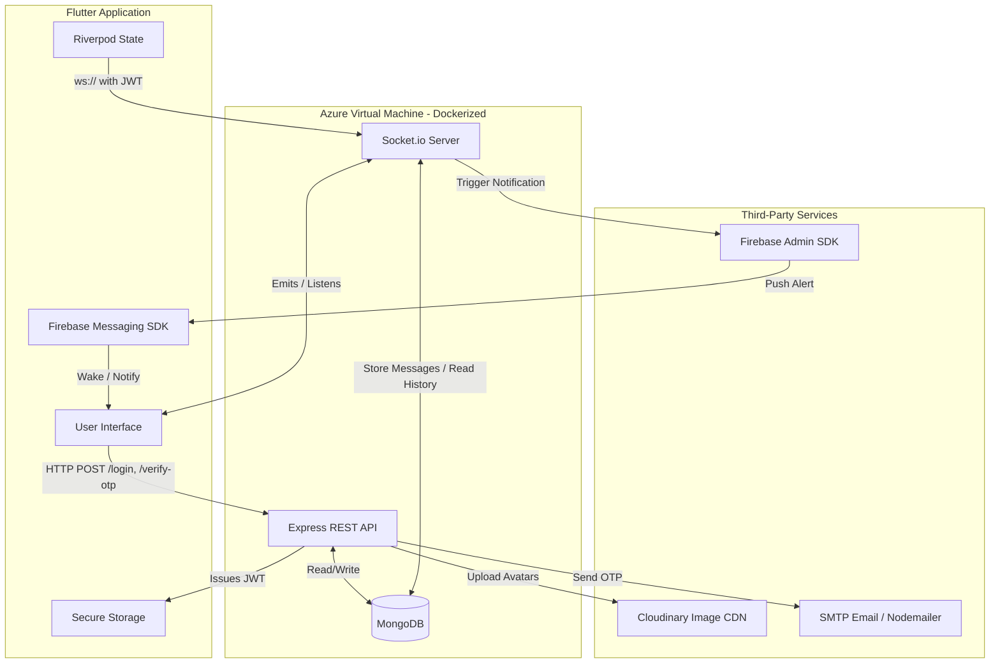

# BlinkChat: Real-Time Encrypted Cross-Platform Messaging App

## Overview

**BlinkChat** is a scalable, cross-platform real-time messaging application designed to provide a seamless and secure communication experience. Currently live and hosted on a **Microsoft Azure Virtual Machine**, the platform allows users to register, authenticate, and communicate instantly.

While the application is fully functional and open for user registration, it remains under active development. New features are continuously being implemented, and existing infrastructure is being fine-tuned to ensure high availability, optimal performance, and robust security.

## Technology Stack

The project leverages a modern, decoupled architecture using the following technologies:

### Frontend (Client)

* **Framework:** Flutter (Dart)
* **State Management:** Riverpod (`flutter_riverpod`)
* **Real-time Communication:** `socket_io_client`
* **Local Storage:** `flutter_secure_storage` for cryptographic key and token storage
* **Push Notifications:** Firebase Cloud Messaging (FCM) & `flutter_local_notifications`

### Backend (Server)

* **Runtime/Framework:** Node.js with Express.js
* **Real-time Engine:** Socket.io
* **Database:** MongoDB (via Mongoose ORM)
* **Authentication:** JSON Web Tokens (JWT), jBCrypt
* **Media Management:** Cloudinary & Multer
* **Email Services:** Nodemailer (for OTP delivery)

### DevOps & Deployment

* **Containerization:** Docker & Docker Compose
* **CI/CD Pipeline:** GitHub Actions
* **Hosting Environment:** Microsoft Azure Virtual Machine (Ubuntu)

## System Architecture & Connectivity Flow

The system is highly modular. The Flutter client communicates with the Node.js backend via two distinct channels: **REST APIs** for standard operations (authentication, profile updates, fetching history) and **WebSockets** for real-time bidirectional messaging. The backend interfaces with a containerized MongoDB instance to persist data.

### Architecture Flow Diagram

=======

## System Architecture

The system is highly modular. The Flutter client communicates with the Node.js backend via two distinct channels: **REST APIs** for standard operations (authentication, profile updates, fetching history) and **WebSockets** for real-time bidirectional messaging. The backend interfaces with a containerized MongoDB instance to persist data.

#### Component Integration Details

1. **Frontend to Backend (REST):** The Flutter app utilizes the `http` package to interact with Express endpoints (e.g., `/login`, `/register`, `/chat/conversations`). Upon successful login, the server issues a JWT, which the client securely stores using `flutter_secure_storage`.
2. **Real-Time WebSocket Link:** The Flutter `socket_io_client` establishes a persistent connection with the backend, passing the JWT in the authentication headers. The backend verifies this token before granting socket access.
3. **Database Connection:** The Express server utilizes Mongoose to map JavaScript objects to MongoDB documents, handling complex queries like retrieving paginated chat histories and finding active conversational partners.

---

## Core Features

### 1. Multi-Factor Authentication & OTP

To ensure identity verification, the platform features a Multi-Factor Authentication (MFA) workflow. Users register with an email and must verify their identity using a One-Time Password (OTP) delivered via Nodemailer. Only after successful OTP validation (`/verify-otp`) is the secure JWT provisioned to the client.

### 2. Real-Time Chat Engine

The core messaging engine operates over Socket.io. It supports:

* **Instant Text and Media Delivery:** Messages are emitted and received with sub-second latency.
* **Typing Indicators:** Broadcasts `typing` and `stop_typing` events to specific conversational rooms.
* **Read Receipts:** Tracks message statuses (`sent`, `delivered`, `read`) and synchronizes these states across clients in real-time.

### 3. Firebase Push Notifications

To keep users engaged when the app is in the background or closed:

* Upon login, the Flutter app retrieves an FCM token and syncs it with the backend via the `/fcm-token` endpoint.
* When a message is routed through the Socket server, the backend checks if the recipient is offline.
* If offline, the server invokes the Firebase Admin SDK to push a targeted notification (containing the sender's name and message type) directly to the user's device.

---

## Security Measures

Security is a foundational pillar of this application. It is implemented across multiple layers:

### HTTP & API Security

* **Helmet.js:** Secures Express apps by setting various HTTP headers.
* **Express Rate Limit:** Mitigates brute-force attacks and DDoS attempts on authentication routes.
* **Data Sanitization:** Uses `express-mongo-sanitize` to prevent NoSQL injection attacks, and `xss-clean` to strip malicious scripts from user inputs.

### Socket Authentication

WebSockets can bypass standard HTTP middleware. To secure real-time data, a custom `socketAuth` middleware intercepts the Socket.io handshake, decoding and verifying the JWT before allowing the connection to join private chat rooms.

### Data Encryption at Rest

Messages are not stored in plain text. Before saving a payload to MongoDB, the backend passes the text through a custom `crypto.js` utility, ensuring that message contents remain encrypted within the database (`encrypt` on save, `decrypt` on fetch).

### Client-Side Security

The Flutter application strictly uses `flutter_secure_storage` (which wraps iOS Keychain and Android Keystore) to store sensitive user data, JWTs, and session states, protecting them from device-level extraction.

---

## DevOps & Deployment Architecture

The application is orchestrated using modern DevOps practices to ensure a reliable and reproducible environment.

### Docker Containerization

Both the Node.js backend and the MongoDB database are containerized using Docker. A `docker-compose.yml` file defines the infrastructure, linking the backend to the database and mapping secure volumes (`mongo-data`) to persist chat histories across container restarts.

### Automated CI/CD with GitHub Actions

Deployment to the Microsoft Azure Virtual Machine is fully automated. The `.github/workflows/deploy.yml` pipeline triggers automatically upon pushes to the `main` branch:

1. **SSH Authentication:** Securely connects to the Azure VM using stored repository secrets.
2. **Code Synchronization:** Pulls the latest commits from the repository.
3. **Container Orchestration:** Safely tears down the old containers and rebuilds the backend image (`docker compose up -d --build`) with zero manual intervention.

---

## Future Roadmap

As an actively developed project, the upcoming roadmap includes:

* Implementing End-to-End (E2E) encryption via the Signal Protocol.
* Adding WebRTC support for voice and video calling.
* Enhancing media compression algorithms for faster image and file sharing.
* Implementing advanced group chat administration features.
